# Fonts

Each font has a numeric ID you pass as `display_name_font_id`. There are 12 fonts available.

---

## Font Previews

| ID | Preview |
|----|---------|
| `1` — Bangers | 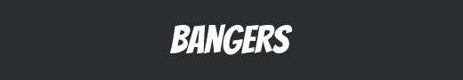 |
| `2` — BioRhyme | 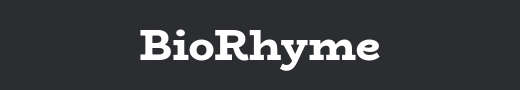 |
| `3` — Cherry Bomb | 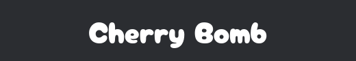 |
| `4` — Chicle | 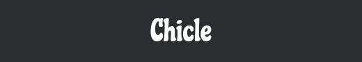 |
| `5` — Compagnon | 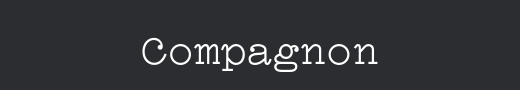 |
| `6` — MuseoModerno | 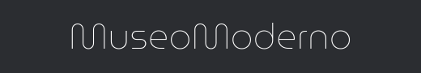 |
| `7` — Neo-Castel | 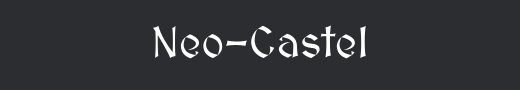 |
| `8` — Pixelify Sans | 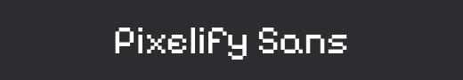 |
| `9` — Ribes | 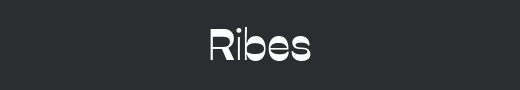 |
| `10` — Sinistre | 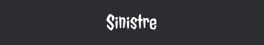 |
| `11` — Default (GG Sans) | 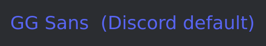 |
| `12` — Zilla Slab | 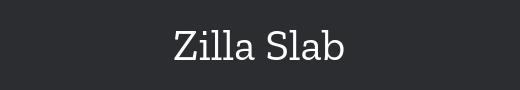 |

---

## Font Reference

| ID | Name | Label | Style |
|----|------|-------|-------|
| `1` | Bangers | Bold Comic | Thick, comic-book lettering |
| `2` | BioRhyme | Elegant Serif | Classic serif, refined look |
| `3` — Cherry Bomb | Sakura | Playful bubble-style characters |
| `4` | Chicle | Jellybean | Rounded, soft and bubbly |
| `5` | Compagnon | Display | Stylish mixed-weight display font |
| `6` | MuseoModerno | Modern | Clean, geometric, modern feel |
| `7` | Neo-Castel | Medieval | Gothic, dark medieval lettering |
| `8` | Pixelify Sans | 8Bit | Retro pixel/blocky characters |
| `9` | Ribes | Decorative | Expressive, decorative display |
| `10` | Sinistre | Vampyre | Dark, jagged, gothic elegant |
| `11` | Default (GG Sans) | Default | Standard Discord font — no change |
| `12` | Zilla Slab | Tempo | Modern slab-serif, balanced weight |

---

## Usage

Sets font `10` (Sinistre), effect `1` (Solid), color white:

```js
await rest.patch(`/guilds/${guildId}/members/@me`, {
  body: {
    display_name_font_id: 10,
    display_name_effect_id: 1,
    display_name_colors: [16777215],
  },
});
```

---

## Pairing Suggestions

| Font ID | Pairs Well With Effect |
|---------|----------------------|
| `10` — Sinistre | `3` Neon — dramatic glow on dark font |
| `9` — Ribes | `3` Neon or `6` Glow — decorative with light |
| `7` — Neo-Castel | `2` Gradient — medieval with color blend |
| `8` — Pixelify Sans | `5` Pop — retro with colored shadow |
| `3` — Cherry Bomb | `4` Toon — soft font with stroke outline |
| `1` — Bangers | `6` Glow — bold comic with color glow |
| `12` — Zilla Slab | `1` Solid — clean and sharp |

---

## Notes

- Font ID `11` (Default / GG Sans) is Discord's standard font — passing it applies no visual font change, but the effect and colors still apply
- Font IDs are integers `1`–`12` — passing `0` or any out-of-range value returns a `400 Bad Request`
- There is no ID `13` or beyond — the list is fixed
